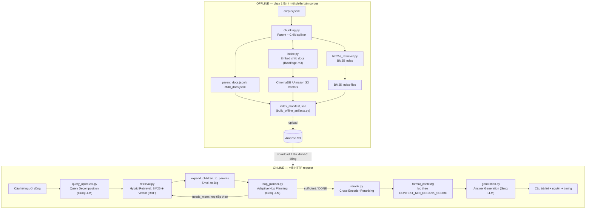

# Báo cáo kỹ thuật: Kiến trúc và Cơ chế hoạt động của Hệ thống RAG Đa chặng (Multi-hop RAG) trên bộ dữ liệu HotpotQA

**Phạm vi:** Backend (`backend/advanced_rag/`, `backend/app/`, `backend/scripts/`, `backend/evals/`)
**Kho mã nguồn:** `aws-rag-project`
**Ngày biên soạn:** 2026-07-30

---

## Tóm tắt (Abstract)

Báo cáo này trình bày chi tiết kiến trúc và cơ chế vận hành của một hệ thống Retrieval-Augmented Generation (RAG) hỏi-đáp đa chặng (multi-hop question answering) được xây dựng trên bộ dữ liệu HotpotQA. Khác với một pipeline RAG "naive" (truy hồi một lần rồi sinh câu trả lời), hệ thống áp dụng đồng thời năm kỹ thuật nâng cao: (1) phân rã truy vấn (query decomposition) bằng LLM cho câu hỏi nhiều bước suy luận; (2) truy hồi lai ghép (hybrid retrieval) giữa BM25 (sparse, từ khóa) và tìm kiếm vector (dense, ngữ nghĩa) hợp nhất bằng Reciprocal Rank Fusion; (3) mở rộng ngữ cảnh theo chiến lược "small-to-big" (child chunk → parent document); (4) lập kế hoạch truy hồi thích nghi theo nhiều chặng (adaptive hop planning) dựa trên bằng chứng vừa tìm được; và (5) tái xếp hạng (reranking) bằng cross-encoder trước khi đưa ngữ cảnh vào bước sinh câu trả lời. Toàn bộ hệ thống được thiết kế theo nguyên tắc tách biệt nghiêm ngặt giữa pha xử lý ngoại tuyến (offline indexing) tốn kém và pha phục vụ trực tuyến (online serving) yêu cầu độ trễ thấp. Báo cáo trình bày cơ sở lý thuyết, mã nguồn minh họa cho từng thành phần, phương pháp đánh giá bằng Exact Match/F1 theo chuẩn HotpotQA, và các quyết định thiết kế được rút ra từ quá trình thực nghiệm trực tiếp trên corpus.

---

## Mục lục

1. [Giới thiệu](#1-giới-thiệu)
2. [Kiến trúc tổng thể hệ thống](#2-kiến-trúc-tổng-thể-hệ-thống)
3. [Pha Offline: Xây dựng chỉ mục](#3-pha-offline-xây-dựng-chỉ-mục-indexing)
4. [Pha Online: Bộ máy truy vấn thời gian thực](#4-pha-online-bộ-máy-truy-vấn-thời-gian-thực)
5. [Lớp dịch vụ: FastAPI Service Layer](#5-lớp-dịch-vụ-fastapi-service-layer)
6. [Phương pháp luận đánh giá](#6-phương-pháp-luận-đánh-giá-evaluation-methodology)
7. [Các quyết định thiết kế thực nghiệm quan trọng](#7-các-quyết-định-thiết-kế-thực-nghiệm-quan-trọng)
8. [Giới hạn hệ thống và hướng phát triển](#8-giới-hạn-hệ-thống-và-hướng-phát-triển)
9. [Kết luận](#9-kết-luận)
10. [Tài liệu tham khảo](#10-tài-liệu-tham-khảo)

---

## 1. Giới thiệu

### 1.1 Bài toán Question Answering đa chặng (Multi-hop QA)

Các hệ thống hỏi-đáp (Question Answering - QA) truyền thống dựa trên truy hồi một bước: tìm một đoạn văn bản chứa câu trả lời rồi trích xuất trực tiếp. Cách tiếp cận này thất bại với các câu hỏi **đa chặng (multi-hop)**, tức những câu hỏi mà câu trả lời không nằm trong một tài liệu đơn lẻ mà đòi hỏi kết hợp thông tin từ ≥ 2 tài liệu qua một "thực thể cầu nối" (bridge entity). Ví dụ điển hình trong bộ eval của hệ thống:

> *"The American folksinger who was married to the man born as James Henry Miller has lived in which country for more than 30 years?"*

Để trả lời, hệ thống phải: (i) xác định "man born as James Henry Miller" là Ewan MacColl; (ii) xác định vợ ông là ca sĩ dân ca Peggy Seeger; (iii) tra cứu quốc gia Peggy Seeger đã sống > 30 năm. Không một tài liệu đơn lẻ nào chứa đủ cả ba sự kiện này.

### 1.2 Retrieval-Augmented Generation (RAG) — cơ sở lý thuyết

RAG (Lewis et al., 2020) kết hợp một **retriever** (truy hồi tài liệu liên quan từ một kho ngữ liệu lớn) với một **generator** (mô hình sinh ngôn ngữ tổng hợp câu trả lời từ ngữ cảnh được truy hồi), thay vì yêu cầu mô hình ngôn ngữ "nhớ" toàn bộ tri thức trong tham số của nó. Ưu điểm: (a) tri thức có thể cập nhật bằng cách thay corpus mà không cần huấn luyện lại; (b) câu trả lời có thể được **truy vết (attributable)** về nguồn tài liệu cụ thể; (c) giảm hiện tượng "hallucination" khi mô hình sinh bị ràng buộc bởi ngữ cảnh thực.

Hệ thống trong báo cáo này mở rộng RAG cơ bản theo hướng **agentic multi-hop retrieval**: thay vì một lượt retrieve→generate, retriever được gọi lặp lại nhiều lượt (hop), mỗi lượt được định hướng bởi bằng chứng thu được ở lượt trước.

### 1.3 Bộ dữ liệu HotpotQA

HotpotQA (Yang et al., 2018) là bộ dữ liệu QA đa chặng gồm các câu hỏi được gán nhãn dựa trên hai bài viết Wikipedia "cầu nối" với nhau qua một thực thể chung, kèm nhãn *supporting facts* ở cấp câu. Hệ thống dùng một tập con (validation slice, 100 dòng trong cấu hình demo hiện tại — xem `S3_PROCESSED_ID = "hotpotqa-val100-v001"`) làm corpus nạp vào, và dùng định dạng câu trả lời ngắn (một từ/tên riêng/cụm từ, hoặc "yes"/"no") của HotpotQA làm mục tiêu chấm điểm Exact Match (EM) / F1.

---

## 2. Kiến trúc tổng thể hệ thống

### 2.1 Tách biệt Offline Indexing và Online Serving

Nguyên tắc thiết kế cốt lõi — được phát biểu tường minh ngay trong docstring của `pipeline.py` — là pha trực tuyến **tuyệt đối không được** chunk lại corpus, embed lại tài liệu, hay xây lại chỉ mục BM25/vector tại thời điểm khởi động hoặc khi xử lý request:

```python
# backend/advanced_rag/pipeline.py
"""Online retrieval pipeline.

The online path must only load existing offline artifacts:

  parent_docs.jsonl
  child_docs.jsonl
  S3 Vectors or ChromaDB
  BM25 index
  index_manifest.json

It must not chunk corpus files, embed documents, or rebuild BM25/vector indexes at
startup. Those expensive steps belong in scripts/build_offline_artifacts.py.
"""
```

Ràng buộc này được thực thi cứng tại constructor của `AdvancedRAGPipeline`: nếu gọi với `force_reindex=True`, pipeline chủ động raise lỗi thay vì âm thầm rebuild:

```python
if force_reindex:
    raise ValueError(
        "AdvancedRAGPipeline is online-only now and does not rebuild indexes. "
        "Use scripts/build_offline_artifacts.py or tools/index_run.py for offline builds."
    )
```

Lý do kiến trúc: embedding hàng trăm nghìn tài liệu và xây HNSW index cho vector store là các thao tác tốn hàng phút đến hàng giờ, không thể chấp nhận được trong vòng đời một HTTP request hay ở mỗi lần khởi động lại service. Việc tách pha cho phép: (i) service khởi động nhanh (chỉ đọc file JSONL + load index có sẵn); (ii) nhiều phiên bản index (theo `index_id`) được build độc lập và service có thể chuyển đổi giữa chúng chỉ bằng cách đổi một tham số cấu hình (SSM parameter), không cần build lại image hay redeploy.

### 2.2 Sơ đồ luồng dữ liệu



### 2.3 Cấu trúc mã nguồn (module map)

| Module | Trách nhiệm |
| --- | --- |
| `advanced_rag/config.py` | Toàn bộ siêu tham số (chunk size, top-k, trọng số hybrid, model Groq), có thể override qua biến môi trường |
| `advanced_rag/chunking.py` | Sinh Parent chunk (toàn bài viết) và Child chunk (đoạn nhỏ) từ `corpus.jsonl` |
| `advanced_rag/index.py` | Embed child chunk bằng `sentence-transformers`, ghi vào ChromaDB |
| `advanced_rag/bm25s_retriever.py` | Retriever BM25 (thư viện `bm25s`), tương thích interface `BaseRetriever` của LangChain |
| `advanced_rag/s3vectors_retriever.py` | Retriever dense qua Amazon S3 Vectors (thay thế ChromaDB khi deploy) |
| `advanced_rag/artifacts.py` | Nạp/tải artifact ngoại tuyến, dựng lại retriever, **không** rebuild bất cứ gì |
| `advanced_rag/retrieval.py` | Hợp nhất BM25 + Vector bằng RRF (`EnsembleRetriever`), mở rộng small-to-big |
| `advanced_rag/query_optimizer.py` | Phân rã câu hỏi đa chặng bằng Groq LLM |
| `advanced_rag/hop_planner.py` | Lập kế hoạch hop tiếp theo dựa trên bằng chứng đã truy hồi |
| `advanced_rag/rerank.py` | Tái xếp hạng candidate bằng cross-encoder |
| `advanced_rag/generation.py` | Sinh câu trả lời ngắn gọn từ ngữ cảnh đã rerank |
| `advanced_rag/groq_utils.py` | Throttle + retry + theo dõi token usage cho mọi lệnh gọi Groq |
| `advanced_rag/pipeline.py` | `AdvancedRAGPipeline` — điều phối toàn bộ các bước trên |
| `app/main.py` | FastAPI service: `/health`, `/warmup`, `/query` |
| `scripts/build_offline_artifacts.py` | CLI build toàn bộ artifact ngoại tuyến + upload S3 |
| `evals/*.py` | Đánh giá retrieval coverage và EM/F1 |

---

## 3. Pha Offline: Xây dựng chỉ mục (Indexing)

### 3.1 Chiến lược Parent-Child Chunking

Hệ thống áp dụng mô hình **Parent Document Retriever** (small-to-big retrieval): mỗi bài viết Wikipedia trong `corpus.jsonl` được biểu diễn ở hai cấp độ hạt (granularity):

- **Parent chunk**: toàn văn bài viết, dùng làm đơn vị ngữ cảnh cuối cùng đưa vào LLM sinh câu trả lời (đủ ngữ cảnh, tránh cắt cụt thông tin).
- **Child chunk**: các đoạn nhỏ (250–500 ký tự) cắt từ parent, dùng làm đơn vị lập chỉ mục và tìm kiếm (độ chính xác cao hơn — một truy vấn ngắn khớp tốt hơn với một đoạn nhỏ, súc tích hơn là với toàn bài viết dài).

```python
# backend/advanced_rag/chunking.py
def _process_line(idx_line: tuple[int, str]) -> tuple[Document, list[Document]]:
    idx, line = idx_line
    data = json.loads(line.strip())
    title = data.get("title", "Unknown Title")
    text = data.get("text", "")

    # 1. Tạo Parent Chunk (Đại diện cho toàn bộ ngữ cảnh bài viết)
    parent_id = f"doc_{idx}"
    metadata = {"parent_id": parent_id, "title": title}
    parent_doc = Document(page_content=text, metadata=metadata)

    # 2. Tạo Child Chunks để phục vụ việc search chính xác
    child_docs = []
    children = _child_splitter.split_text(text)
    for child_idx, child_text in enumerate(children):
        child_meta = metadata.copy()
        child_meta["child_id"] = f"{parent_id}-child-{child_idx}"
        child_docs.append(Document(page_content=child_text, metadata=child_meta))

    return parent_doc, child_docs
```

Việc chunk văn bản dùng `RecursiveCharacterTextSplitter` của LangChain với các dấu phân tách theo thứ tự ưu tiên `["\n", ". ", " "]` (ưu tiên tách theo đoạn văn, rồi câu, rồi từ — tránh cắt ngang một câu bất cứ khi nào có thể):

```python
_child_splitter = RecursiveCharacterTextSplitter(
    chunk_size=config.CHILD_CHUNK_SIZE,      # 500 ký tự
    chunk_overlap=config.CHILD_CHUNK_OVERLAP, # 100 ký tự (20%)
    separators=["\n", ". ", " "],
)
```

**Cơ sở thực nghiệm cho việc chọn 500/100** (trích nguyên văn ghi chú kỹ thuật trong `config.py`, phản ánh một thí nghiệm định lượng thật trên toàn bộ 507.494 tài liệu):

> Giá trị cũ (250/50): chỉ 18,4% tài liệu vừa trong một chunk 250 ký tự (median độ dài tài liệu = 428 ký tự) → phần lớn tài liệu ngắn vẫn bị chia thành ≥ 2 chunk một cách không cần thiết, gây thừa lệnh gọi embedding.
> Giá trị mới (500/100, giữ nguyên tỉ lệ overlap 20%): số child chunk giảm từ 1.444.666 xuống 753.753 (−47,8%), và 61,5% tài liệu gói gọn trong đúng một chunk.

Đây là một minh chứng cụ thể cho nguyên tắc: **siêu tham số chunking không nên chọn tùy ý** mà cần được hiệu chỉnh dựa trên phân phối độ dài thực tế của corpus.

Việc chunk hóa được **song song hóa qua nhiều tiến trình** (CPU-bound: parse JSON + split text) bằng `multiprocessing.Pool`, dùng `imap` để giữ đúng thứ tự dòng vào (đảm bảo `parent_id = f"doc_{idx}"` luôn khớp với số thứ tự dòng gốc trong corpus):

```python
num_workers = os.cpu_count() or 1
with Pool(processes=num_workers, initializer=_init_worker) as pool:
    chunksize = max(1, len(lines) // (num_workers * 4))
    for parent_doc, children in pool.imap(_process_line, lines, chunksize=chunksize):
        parent_docs.append(parent_doc)
        child_docs.extend(children)
```

### 3.2 Sinh biểu diễn vector: mô hình embedding BAAI/bge-m3

Hệ thống dùng **BAAI/bge-m3** (Chen et al., 2024) — một mô hình embedding đa ngôn ngữ, đa chức năng, mã nguồn mở, chạy được cục bộ (không phụ thuộc API embedding trả phí) — để mã hóa các **child chunk** thành vector dày đặc (dense vector), chuẩn hóa L2 (`normalize_embeddings=True`) để tương đồng cosine tương đương tích vô hướng.

```python
# backend/advanced_rag/index.py
def _encode_and_insert_in_groups(child_docs: list[Document], client, collection) -> None:
    model = SentenceTransformer(
        config.EMBEDDING_MODEL_NAME,   # "BAAI/bge-m3"
        device=config.DEVICE,          # "cuda" nếu có GPU, tự fallback "cpu"
        model_kwargs=_st_model_kwargs(),
    )
    ...
    for group_idx, start in enumerate(range(0, total, group_size), start=1):
        group_docs = child_docs[start:end]
        ids = [doc.metadata["child_id"] for doc in group_docs]

        # Cho phép resume: bỏ qua group đã insert đầy đủ từ lần chạy trước
        existing = collection.get(ids=ids, include=[])
        if len(existing["ids"]) == len(ids):
            continue

        vectors = model.encode(
            texts, batch_size=config.EMBEDDING_BATCH_SIZE,
            normalize_embeddings=True, show_progress_bar=True,
        )
        for i in range(0, len(texts), insert_batch_size):
            j = i + insert_batch_size
            collection.upsert(  # upsert, không phải add — an toàn khi resume
                documents=texts[i:j], embeddings=vectors[i:j].tolist(),
                metadatas=metadatas[i:j], ids=ids[i:j],
            )
```

Hai quyết định kỹ thuật đáng chú ý:

1. **Xử lý theo nhóm (`INDEXING_GROUP_SIZE = 20.000` chunk/nhóm)** thay vì encode toàn bộ corpus trong một lần rồi mới insert. Lý do: encode-rồi-insert-một-lần đòi hỏi toàn bộ vector của corpus nằm trong RAM cùng lúc (có thể tới vài GB ở corpus lớn), và nếu tiến trình bị gián đoạn giữa chừng (ví dụ mất kết nối Colab khi chạy hàng giờ) thì mất sạch tiến độ vì chưa có gì được ghi xuống đĩa.
2. **`upsert` thay vì `add`**, kết hợp kiểm tra `collection.get(ids=ids)` trước khi encode một nhóm — cho phép **resume an toàn**: nếu tiến trình bị ngắt giữa chừng, lần chạy lại chỉ encode các nhóm còn thiếu thay vì làm lại từ đầu.

Trong triển khai production, backend dùng **Amazon S3 Vectors** thay cho ChromaDB cục bộ làm vector store (xem mục 3.4 và 4.1), nhưng mô hình embedding và logic chuẩn hóa vector là như nhau.

### 3.3 Chỉ mục thưa (sparse): BM25 qua thư viện `bm25s`

Song song với vector index, hệ thống xây một chỉ mục **BM25** (Robertson & Zaragoza, 2009) — thuật toán xếp hạng dựa trên tần suất từ (term frequency) và độ hiếm nghịch đảo của tài liệu (inverse document frequency), mạnh về khớp từ khóa/tên riêng chính xác, bù cho điểm yếu của tìm kiếm vector ở các câu hỏi tra cứu tên riêng (xem phân tích ở mục 7.1).

```python
# backend/advanced_rag/bm25s_retriever.py
class BM25SRetriever(BaseRetriever):
    docs: List[Document] = Field(repr=False)
    retriever: Any = None
    k: int = 10

    @classmethod
    def from_documents(cls, documents, k=10, path=None) -> "BM25SRetriever":
        retriever = bm25s.BM25()
        if path and os.path.exists(path):
            retriever = bm25s.BM25.load(path, load_corpus=False)
        else:
            corpus_tokens = bm25s.tokenize(
                [doc.page_content for doc in documents], stopwords="en",
            )
            retriever.index(corpus_tokens)
            if path:
                retriever.save(path, corpus=None)
        return cls(docs=documents, retriever=retriever, k=k)

    def _get_relevant_documents(self, query, *, run_manager):
        query_tokens = bm25s.tokenize(query, stopwords="en")
        k = min(self.k, len(self.docs))
        results, _scores = self.retriever.retrieve(query_tokens, k=k)
        return [self.docs[i] for i in results[0]]
```

Lớp này kế thừa `BaseRetriever` của LangChain nên có thể hoán đổi trực tiếp với retriever vector trong `EnsembleRetriever` (mục 4.3) mà không cần thay đổi logic hợp nhất. Chỉ mục BM25 được **build một lần ở pha offline và serialize xuống đĩa** (`retriever.save(path, ...)`), pha online chỉ `bm25s.BM25.load(path, load_corpus=False)` — tải lại cấu trúc chỉ mục đã dựng sẵn (postings list, IDF) mà không cần tokenize lại toàn bộ corpus.

### 3.4 Đóng gói Artifact & Index Manifest (tính tái lập)

Script `scripts/build_offline_artifacts.py` là điểm vào duy nhất của pha offline, thực hiện tuần tự: chunk → ghi `parent_docs.jsonl`/`child_docs.jsonl` → build ChromaDB/S3 Vectors → build BM25 → ghi **`index_manifest.json`** → (tùy chọn) upload toàn bộ lên S3 theo một layout chuẩn.

`index_manifest.json` đóng vai trò trung tâm cho tính **tái lập (reproducibility)** và **truy vết (provenance)**: mọi tham số dùng để build (kích thước chunk, model embedding, checksum SHA-256 của từng file artifact, số dòng corpus nguồn) được ghi lại tường minh:

```python
# backend/scripts/build_offline_artifacts.py
manifest = {
    "schema_version": 1,
    "index_id": args.index_id,
    "created_at": datetime.now(timezone.utc).isoformat(),
    "source": {
        "corpus_path": original_corpus_path,
        "corpus_rows": count_jsonl(corpus_path),
        "corpus_sha256": sha256_of(corpus_path),
    },
    "params": {
        "embedding_model": config.EMBEDDING_MODEL_NAME,
        "child_chunk_size": config.CHILD_CHUNK_SIZE,
        "child_chunk_overlap": config.CHILD_CHUNK_OVERLAP,
        "bm25_top_k": config.BM25_TOP_K,
        ...
    },
    "artifacts": {
        "parent_docs": {"path": ..., "num_docs": ..., "sha256": ...},
        "child_docs":  {"path": ..., "num_docs": ..., "sha256": ...},
        "chroma_db":   chroma_stats,
        "bm25":        bm25_stats,
    },
    "timings_seconds": {...},
}
```

Nhờ có checksum SHA-256 cho mỗi artifact, pha online (mục 4.1) có thể xác minh tính toàn vẹn của dữ liệu tải về từ S3 trước khi phục vụ truy vấn, và mọi thay đổi corpus/tham số sẽ tạo ra một `index_id` mới — cho phép nhiều phiên bản index tồn tại song song và service chuyển đổi giữa chúng chỉ bằng một tham số cấu hình runtime (không cần build lại/redeploy container), như mô tả ở `README.md` mục 6.

---

## 4. Pha Online: Bộ máy truy vấn thời gian thực

### 4.1 Nạp Artifact không tính toán lại (`artifacts.py`)

Khi service khởi động, `load_online_artifacts()` thực hiện đúng những gì docstring của `pipeline.py` yêu cầu: đọc `index_manifest.json`, resolve đường dẫn các artifact, và (nếu chưa có ở local) tải chúng từ S3 về:

```python
# backend/advanced_rag/artifacts.py (rút gọn)
def load_online_artifacts(...) -> OnlineArtifacts:
    manifest_path = _find_manifest_path(root_dir, s3_index_id)
    if not manifest_path and (auto_download or force_download):
        ensure_artifacts_available(root_dir, s3_bucket=..., ...)  # download từ S3
    manifest = _load_json(manifest_path)
    _apply_manifest_config(manifest, root_dir, device)  # override config theo manifest

    parent_docs = _load_jsonl_documents(parent_docs_path, text_key="text", id_key="parent_id")
    child_docs  = _load_jsonl_documents(child_docs_path,  text_key="text", id_key="child_id")
    child_docs  = _reorder_child_docs_for_bm25(child_docs, bm25_doc_ids_path)

    bm25_retriever = BM25SRetriever.load_from_path(child_docs, k=config.BM25_TOP_K, path=bm25_index_path)

    if _is_s3vectors_manifest(manifest):
        vector_retriever = S3VectorsRetriever.from_documents(child_docs, ...)
        vector_backend = "s3vectors"
    else:
        vectorstore = _load_chroma_vectorstore(root_dir, manifest)
        vector_retriever = vectorstore.as_retriever(search_kwargs={"k": config.VECTOR_TOP_K})
        vector_backend = "chroma"

    return OnlineArtifacts(..., vector_backend=vector_backend)
```

Điểm đáng chú ý: `_reorder_child_docs_for_bm25` sắp xếp lại danh sách `child_docs` theo đúng thứ tự `bm25_doc_ids.json` được ghi lại lúc build offline — vì chỉ mục BM25 serialize (`bm25s.BM25.save/.load`) chỉ lưu cấu trúc thống kê (postings, IDF), **không** lưu lại văn bản gốc (`load_corpus=False`); ánh xạ vị trí-số-nguyên (integer position) trong chỉ mục về `Document` object đúng phải dựa vào thứ tự danh sách đầu vào khớp tuyệt đối với lúc index — sai lệch thứ tự ở đây sẽ khiến BM25 trả về **sai tài liệu** một cách âm thầm (không có exception nào được ném ra).

Hệ thống hỗ trợ **hai backend vector song song** với cùng một interface `BaseRetriever`, chọn qua trường `schema_version`/`s3_vectors` trong manifest:

- **ChromaDB** (local, dùng cho phát triển/notebook, `langchain_chroma.Chroma`).
- **Amazon S3 Vectors** (dùng ở production/EC2 — dịch vụ vector-store managed của AWS, gọi qua `boto3.client("s3vectors")`).

```python
# backend/advanced_rag/s3vectors_retriever.py
def _get_relevant_documents(self, query, *, run_manager):
    response = self._get_client().query_vectors(
        vectorBucketName=self.vector_bucket_name,
        indexName=self.index_name,
        queryVector={"float32": self._encode_query(query)},
        topK=min(self.k, len(self.docs_by_id)),
        returnDistance=self.return_distance,
    )
    docs = []
    for item in response.get("vectors", []):
        child_id = item.get("key")
        doc = self.docs_by_id.get(child_id)
        if doc is None:
            continue
        metadata = dict(doc.metadata)
        if "distance" in item:
            metadata["s3vectors_distance"] = item["distance"]
        docs.append(Document(page_content=doc.page_content, metadata=metadata))
    return docs
```

Việc mã hóa mô hình embedding (`SentenceTransformer`) và client `boto3` được khởi tạo **lười (lazy) và thread-safe** bằng `PrivateAttr` + `Lock` (double-checked locking) — tránh việc mỗi request tạo lại client/tải lại model nhiều lần trong môi trường đa luồng của FastAPI.

### 4.2 Phân rã truy vấn (Query Decomposition) bằng LLM

Bước đầu tiên của một truy vấn là hỏi một LLM nhỏ, nhanh (`llama-3.1-8b-instant` qua Groq API) phân rã câu hỏi gốc thành các câu hỏi con độc lập, tuần tự về mặt logic — cải thiện khả năng retriever tìm đúng tài liệu cho **từng phần** của câu hỏi thay vì cố khớp toàn bộ câu hỏi phức hợp cùng lúc:

```python
# backend/advanced_rag/query_optimizer.py
SYSTEM_PROMPT = """You are an expert AI assistant specialized in Information Retrieval.
Your task is to break down complex, multi-hop questions into simpler, independent sub-questions...
Rules:
1. If the question contains multiple logical steps, break it down into 2 or 3 chronological sub-questions.
2. If the question is already simple and direct, just return the original question in a list.
3. Return the output EXACTLY as JSON: {"sub_queries": [...]}
"""

def decompose_query(original_query: str) -> list[str]:
    try:
        client = get_client()
        response = call_with_retry(lambda: client.chat.completions.create(
            model=config.GROQ_DECOMPOSE_MODEL,
            messages=[{"role": "system", "content": SYSTEM_PROMPT},
                      {"role": "user", "content": f"Decompose this question: {original_query}"}],
            temperature=0.1,
            response_format={"type": "json_object"},
        ), model=config.GROQ_DECOMPOSE_MODEL, label="decompose")
        sub_queries = json.loads(response.choices[0].message.content).get("sub_queries", [original_query])
        return sub_queries or [original_query]
    except Exception:
        return [original_query]   # fallback an toàn: coi như câu hỏi đơn giản
```

Hai nguyên tắc thiết kế phòng thủ (defensive design) quan trọng ở đây, lặp lại xuyên suốt mọi lệnh gọi LLM trong hệ thống:

- **`temperature=0.1`** và **`response_format={"type": "json_object"}`**: ép mô hình trả về JSON có cấu trúc chặt, giảm phương sai giữa các lần gọi cho cùng một câu hỏi.
- **Fallback an toàn (`except Exception: return [original_query]`)**: nếu Groq lỗi (hết quota, mất mạng, JSON không hợp lệ), hệ thống **không sập** mà coi câu hỏi là đơn giản và tiếp tục với câu hỏi gốc — quan trọng khi chạy eval hàng loạt hàng nghìn câu hỏi (`eval_full.py`), một lỗi đơn lẻ không được làm hỏng cả batch.

### 4.3 Truy hồi lai ghép (Hybrid Retrieval): BM25 ⊕ Vector qua Reciprocal Rank Fusion

Đây là tầng lõi của hệ thống truy hồi. Ý tưởng: BM25 (khớp từ khóa/tên riêng chính xác) và tìm kiếm vector (khớp ngữ nghĩa) có **điểm mạnh bù trừ nhau** — kết hợp cả hai cho kết quả tốt hơn dùng riêng lẻ mỗi cái.

```python
# backend/advanced_rag/retrieval.py
def build_hybrid_retriever(bm25_retriever, vector_retriever, weights: list[float]) -> EnsembleRetriever:
    return EnsembleRetriever(retrievers=[bm25_retriever, vector_retriever], weights=weights)
```

`EnsembleRetriever` của LangChain hợp nhất hai danh sách xếp hạng bằng **Reciprocal Rank Fusion có trọng số** (Cormack et al., 2009). Với mỗi tài liệu \(d\) xuất hiện ở hạng \(\text{rank}_r(d)\) trong danh sách kết quả của retriever \(r\) (trọng số \(w_r\)), điểm hợp nhất là:

$$
\text{RRF}(d) = \sum_{r \in \{\text{BM25},\ \text{Vector}\}} w_r \cdot \frac{1}{\text{rank}_r(d) + c}, \qquad c = 60
$$

(hằng số `c` là tham số làm mượt chuẩn của công thức RRF gốc, giữ nguyên giá trị mặc định của thư viện). Cơ chế này có một tính chất quan trọng: nó chỉ dùng **thứ hạng (rank)**, không dùng điểm số thô của từng retriever — tránh vấn đề thang đo không tương thích giữa điểm BM25 (không giới hạn trên) và điểm cosine similarity (trong khoảng [-1, 1]).

**Trọng số hybrid không cố định mà thay đổi theo số thứ tự hop** — đây là một phát hiện thực nghiệm quan trọng của dự án, được ghi lại chi tiết trong `config.py`:

```python
# backend/advanced_rag/config.py
HYBRID_WEIGHTS_HOP1        = [0.8, 0.2]   # hop đầu: ưu tiên BM25
HYBRID_WEIGHTS_LATER_HOPS  = [0.2, 0.8]   # hop sau: ưu tiên Vector
```

Phân tích thực nghiệm (debug trực tiếp trên corpus đầy đủ, không phải giả định) cho thấy: câu hỏi con ở **hop đầu tiên** (do LLM decompose sinh ra, thường có dạng "Who/What is X" tra thẳng một tên riêng) khớp tốt hơn hẳn với BM25 (ví dụ câu hỏi "Who are Ann and Nancy Wilson?" → BM25 xếp hạng 8, vector search bỏ lỡ hoàn toàn trong top-30). Ngược lại, câu hỏi ở **hop sau** (do hop planner tự viết lại dựa trên bằng chứng, thường là câu diễn giải quan hệ/mô tả đầy đủ hơn thay vì tra tên) khớp tốt hơn với vector search (ví dụ "Which guitar brand was endorsed by Heart?" → vector xếp hạng 1–2, BM25 bỏ lỡ hoàn toàn). Một trọng số tĩnh duy nhất áp cho cả hai loại hop sẽ luôn đánh đổi lệch về một phía; tách trọng số theo cấu trúc hop giải quyết được cả hai trường hợp bằng hai `EnsembleRetriever` riêng biệt (`hybrid_retriever_hop1` và `hybrid_retriever_later` trong `pipeline.py`).

### 4.4 Mở rộng Small-to-Big

Kết quả hybrid retrieval trả về các **child chunk** (đơn vị tìm kiếm chính xác nhưng thiếu ngữ cảnh). Bước tiếp theo ánh xạ mỗi child chunk trúng về **parent document** (toàn bài viết) chứa nó, khử trùng lặp và giữ nguyên thứ tự ưu tiên:

```python
# backend/advanced_rag/retrieval.py
def expand_children_to_parents(child_hits: list[Document], parent_docs: list[Document]) -> list[Document]:
    parent_by_id = {p.metadata["parent_id"]: p for p in parent_docs}
    seen: set[str] = set()
    expanded: list[Document] = []
    for child in child_hits:
        parent_id = child.metadata["parent_id"]
        if parent_id in seen:
            continue
        seen.add(parent_id)
        parent = parent_by_id.get(parent_id)
        if parent is not None:
            expanded.append(parent)
    return expanded
```

Đây chính là kỹ thuật **Parent Document Retrieval / small-to-big**: tìm kiếm ở độ hạt mịn (child, 500 ký tự) để có độ chính xác truy hồi cao, nhưng đưa vào các bước sau (rerank, generation) ở độ hạt thô (parent, toàn bài viết) để không mất ngữ cảnh xung quanh câu trả lời — ví dụ nếu chunk trúng chỉ chứa "...được thành lập vào năm 1975 bởi X..." mà không có tên bài viết đang nói về ai, thì parent-doc đầy đủ mới cho LLM đủ ngữ cảnh để trả lời chính xác.

### 4.5 Lập kế hoạch truy hồi thích nghi (Adaptive Hop Planning)

Đây là cơ chế tinh vi nhất của hệ thống, thay thế một cách tiếp cận cũ dựa trên regex quét thực thể viết hoa (đã bị loại bỏ vì các điểm mù cấu trúc: tên một từ như "Coraline", hậu tố phân biệt "(film)", các từ nối thường như "in"/"of" giữa các tên riêng). Cách tiếp cận mới: **sau mỗi hop retrieve, hỏi thẳng một LLM** "dựa trên bằng chứng vừa tìm được, hop tiếp theo nên tìm gì?" — LLM hiểu ngữ nghĩa nên không có các điểm mù cấu trúc của một hệ luật regex.

```python
# backend/advanced_rag/hop_planner.py
HOP_PLANNER_SYSTEM_PROMPT = """You are planning a multi-hop information retrieval search...
1. Summarize the key fact(s) in the evidence relevant to the original question.
2. Decide "sufficient" if the original question can now be FULLY answered, or "needs_more" otherwise.
3. If needs_more, give the single best next search query — prefer inventing a new, specific
   query using a named entity or fact you just learned over reusing a vague planned query.
4. If sufficient, set next_query to exactly "DONE".
Respond ONLY as JSON: {"evidence_summary": "...", "confidence": "sufficient"|"needs_more", "next_query": "..."}
"""

def plan_next_hop(original_question, current_query, evidence_text,
                   remaining_planned_queries, hop_number, max_hops) -> dict:
    fallback = {"evidence_summary": "", "confidence": "sufficient", "next_query": "DONE"}
    try:
        ...
        result = json.loads(response.choices[0].message.content)
        return {"evidence_summary": result.get("evidence_summary", ""),
                "confidence": result.get("confidence", "sufficient"),
                "next_query": result.get("next_query", "DONE")}
    except Exception:
        return fallback   # lỗi Groq -> dừng hop, dùng những gì đã có
```

Vòng lặp điều phối hop nằm trong `pipeline.py::_retrieve_parent_candidates`:

```python
# backend/advanced_rag/pipeline.py
for hop in range(1, max_hops + 1):
    self.last_hop_queries.append(current_query)
    parents = self._retrieve_single_hop(current_query, hop)

    for parent in parents[: config.HOP_CANDIDATE_CAP]:      # cap RIÊNG cho hop này
        parent_id = parent.metadata["parent_id"]
        if parent_id not in seen:
            seen.add(parent_id)
            merged.append(parent)

    if hop == max_hops:
        break

    evidence_text = "\n\n".join(
        f"[{p.metadata.get('title', '')}]\n{p.page_content}"
        for p in parents[: config.HOP_EVIDENCE_TOP_N]
    )
    plan = plan_next_hop(original_question, current_query, evidence_text,
                         planned_queries, hop, max_hops)

    next_query = plan["next_query"].strip()
    if not next_query or next_query.upper() == "DONE" or plan["confidence"] == "sufficient":
        break                                                # dừng sớm nếu đã đủ

    if next_query in planned_queries:
        planned_queries.remove(next_query)
    current_query = next_query
```

Mỗi hop tiêu thụ tối đa `MAX_ADAPTIVE_HOPS` lượt (mặc định 3, hoặc 1 ở `RAG_FAST_MODE`), nhưng **có thể dừng sớm** khi hop planner báo `confidence = "sufficient"` — cân bằng giữa độ đầy đủ của bằng chứng và chi phí độ trễ/API call. Các câu hỏi con đã được `query_optimizer.decompose_query` sinh sẵn được dùng làm **kế hoạch ban đầu** (`planned_queries`), nhưng hop planner có quyền tự đề xuất một truy vấn mới hoàn toàn nếu bằng chứng vừa thấy gợi ý một thực thể cụ thể hơn — đây là điểm khác biệt cốt lõi so với decomposition tĩnh: **kế hoạch truy hồi được điều chỉnh động (adaptive) theo bằng chứng thực tế**, không chỉ theo suy luận tiên nghiệm trước khi thấy dữ liệu nào.

Các câu hỏi con còn lại (`questions[1:]`) được truy hồi **song song bằng `ThreadPoolExecutor`** trước khi vòng lặp hop tuần tự bắt đầu, tận dụng việc các lệnh gọi retrieval là I/O/CPU-bound độc lập với nhau:

```python
if questions:
    with ThreadPoolExecutor(max_workers=min(len(questions), 4)) as executor:
        futures = [executor.submit(self._retrieve_single_hop, q, 1) for q in questions]
        for future in futures:
            parents = future.result()
            ...
```

### 4.6 Tái xếp hạng bằng Cross-Encoder (Reranking)

Tìm kiếm vector/BM25 (tầng "bi-encoder", mã hóa câu hỏi và tài liệu **độc lập** rồi so sánh embedding) nhanh nhưng kém chính xác hơn một **cross-encoder** (Nogueira & Cho, 2019) — mô hình đọc đồng thời cặp (câu hỏi, tài liệu) qua cùng một mạng Transformer và sinh trực tiếp một điểm relevance, nắm bắt tương tác từ-với-từ giữa hai chuỗi mà bi-encoder không thể biểu diễn trong một vector cố định.

```python
# backend/advanced_rag/rerank.py
def get_reranker_model() -> CrossEncoder:
    global _reranker_model
    if _reranker_model is None:
        model_kwargs = {"torch_dtype": torch.float16} if config.DEVICE == "cuda" else None
        _reranker_model = CrossEncoder(
            config.RERANKER_MODEL_NAME,     # "cross-encoder/ms-marco-MiniLM-L-6-v2"
            device=config.DEVICE, max_length=config.RERANK_MAX_LENGTH,
            model_kwargs=model_kwargs,
        )
    return _reranker_model

def rerank(queries: list[str], candidates: list[Document], top_n=None) -> list[tuple[Document, float]]:
    model = get_reranker_model()
    unique_queries = list(dict.fromkeys(queries))
    best_scores = [float("-inf")] * len(candidates)

    all_pairs = []
    for query in unique_queries:
        all_pairs.extend([(query, doc.page_content) for doc in candidates])
    all_scores = model.predict(all_pairs, batch_size=config.RERANK_BATCH_SIZE)  # 1 batch lớn duy nhất

    num_candidates = len(candidates)
    for q_idx in range(len(unique_queries)):
        scores = all_scores[q_idx * num_candidates : (q_idx + 1) * num_candidates]
        for i, score in enumerate(scores):
            if score > best_scores[i]:
                best_scores[i] = score       # điểm CAO NHẤT qua mọi (sub-)query

    ranked = sorted(zip(candidates, best_scores), key=lambda x: x[1], reverse=True)
    return ranked[:top_n]
```

Hai chi tiết thiết kế đáng chú ý:

1. **Chấm điểm theo mọi sub-query rồi lấy max, không chỉ theo câu hỏi gốc.** Một candidate đúng nhưng chỉ trả lời **một hop** của câu hỏi đa chặng (ví dụ tài liệu tiểu sử "Hans Behrendt" chỉ nói ông là đạo diễn, không nhắc gì đến bộ phim đang được hỏi) có thể bị chấm điểm thấp nếu so trực tiếp với toàn bộ câu hỏi ghép — nhưng lại khớp rất tốt với câu hỏi con "Who directed the film?" tách riêng. Lấy điểm max qua tập `{câu hỏi gốc} ∪ {câu hỏi con đã decompose} ∪ {truy vấn từng hop}` đảm bảo candidate đó vẫn được xếp hạng đúng.
2. **Gộp mọi cặp (query, doc) thành một batch lớn duy nhất** cho `model.predict()` thay vì gọi lặp lại theo từng query — tận dụng tối đa thông lượng song song của cross-encoder, giảm số lần forward-pass model.

Cuối cùng, `format_context()` lọc bỏ các candidate có điểm rerank quá thấp trước khi đưa vào bước sinh câu trả lời (`CONTEXT_MIN_RERANK_SCORE = 0.1`) — tránh lãng phí token ngữ cảnh cho các tài liệu "trùng từ khóa nhưng không liên quan" (ví dụ một bộ phim Marvel lọt vào câu hỏi về đạo diễn Ed Wood chỉ vì cùng chứa từ "director"/"American").

### 4.7 Sinh câu trả lời (Answer Generation) có kiểm soát định dạng

Bước cuối gọi Groq LLM sinh câu trả lời **ngắn gọn**, khớp định dạng answer của HotpotQA (một từ/tên riêng/con số, hoặc "yes"/"no"), để có thể chấm điểm EM/F1 tự động so với đáp án gốc:

```python
# backend/advanced_rag/generation.py
GENERATE_SYSTEM_PROMPT = """You answer questions using ONLY the given context.
1. If COMPARE (e.g. "Who is older/younger, X or Y?"):
   a. First write "Reasoning:" stating the exact relevant value for EACH of the two things.
   b. Explicitly work out the comparison from those two values.
   c. Finish with "Answer:" containing only the comparison's result.
2. Otherwise, skip Reasoning and go straight to "Answer:" with the SHORTEST correct span.
3. The "Answer:" line must be the LAST line, containing ONLY the final answer.
4. If insufficient information, output "Answer: unknown"
"""

def _extract_final_answer(raw: str) -> str:
    lines = [ln.strip() for ln in raw.strip().splitlines() if ln.strip()]
    for line in reversed(lines):                 # dòng "Answer:" CUỐI CÙNG
        if line.lower().startswith("answer:"):
            return line.split(":", 1)[1].strip().strip(".")
    return lines[-1].strip().strip(".") if lines else ""
```

Đây là một ví dụ về kỹ thuật **prompting buộc suy luận trung gian (forced intermediate reasoning)** được thêm vào sau khi phát hiện lỗi cụ thể qua debug: với mô hình nhỏ (`llama-3.1-8b-instant`), câu hỏi so sánh dạng "who is younger, X or Y?" đòi hỏi **trừ/so sánh hai con số** (năm sinh); nếu không có bước trung gian, mô hình có xu hướng đoán theo thực thể nào **được nhắc đến nổi bật hơn / xuất hiện sớm hơn** trong ngữ cảnh thay vì theo giá trị thật — hiện tượng được tái hiện trực tiếp bằng cách hoán đổi thứ tự hai đoạn văn chứa hai mốc thời gian giống hệt nhau và quan sát câu trả lời đổi theo thứ tự chứ không theo giá trị. Giải pháp: buộc mô hình trích rõ giá trị của **từng bên** ra dòng "Reasoning:" trước, rồi mới so sánh và chốt ở dòng "Answer:" — chỉ dòng "Answer:" mới được `_extract_final_answer` parse làm câu trả lời thật; dòng Reasoning chỉ tồn tại để ép mô hình thực sự tính toán, không phải để hiển thị cho người dùng.

### 4.8 Bộ điều phối `AdvancedRAGPipeline` — lắp ráp toàn bộ luồng

`pipeline.py::AdvancedRAGPipeline.query()` là điểm lắp ráp toàn bộ các bước ở trên thành một luồng duy nhất, đồng thời đo thời gian (`last_timings`) cho từng giai đoạn — dữ liệu này được trả về trực tiếp trong response API (mục 5) để phục vụ theo dõi hiệu năng:

```python
# backend/advanced_rag/pipeline.py
def query(self, question: str, top_n: int = None) -> list[RetrievalResult]:
    t_start = time.perf_counter()

    self.last_sub_queries = [question] if config.RAG_FAST_MODE else decompose_query(question)
    t_decompose = time.perf_counter()

    parent_candidates = self._retrieve_parent_candidates(question, self.last_sub_queries)
    t_retrieve = time.perf_counter()
    self.last_num_candidates = len(parent_candidates)

    top_n = top_n or config.RERANK_TOP_N
    if self.use_reranker:
        rerank_queries = [question] + self.last_sub_queries + self.last_hop_queries
        ranked = rerank(rerank_queries, parent_candidates, top_n=top_n)
    else:
        ranked = [(doc, 1.0 - (idx * 0.001)) for idx, doc in enumerate(parent_candidates[:top_n])]
    t_rerank = time.perf_counter()

    self.last_timings = {
        "decompose": t_decompose - t_start,
        "retrieve":  t_retrieve - t_decompose,
        "rerank":    t_rerank - t_retrieve,
        "total":     t_rerank - t_start,
    }
    return [RetrievalResult(document=doc, rerank_score=float(score)) for doc, score in ranked]
```

Cờ `RAG_FAST_MODE` (mục 7.4) cho phép **tắt hoàn toàn bước decomposition** (dùng thẳng câu hỏi gốc làm câu hỏi duy nhất) để giảm độ trễ ở môi trường production với ràng buộc timeout nghiêm ngặt. Khi reranker bị tắt (`use_reranker=False`, cấu hình production hiện tại), thứ hạng cuối cùng **giữ nguyên thứ tự truy hồi hybrid** với điểm giả lập giảm dần tuyến tính (`1.0 - idx*0.001`) — chỉ để tương thích kiểu dữ liệu `RetrievalResult`, không phản ánh độ liên quan thực.

---

## 5. Lớp dịch vụ: FastAPI Service Layer

`app/main.py` bọc `AdvancedRAGPipeline` thành một service HTTP với ba route: `GET /health`, `POST /warmup`, `POST /query`. Pipeline được khởi tạo **lười (lazy singleton)**, bảo vệ bằng khóa (`threading.Lock`) để tránh race-condition tải trùng lặp khi nhiều request đầu tiên tới đồng thời:

```python
# backend/app/main.py
_pipeline: "AdvancedRAGPipeline | None" = None
_pipeline_lock = Lock()

def get_pipeline() -> "AdvancedRAGPipeline":
    global _pipeline
    if _pipeline is None:
        with _pipeline_lock:
            if _pipeline is None:                      # double-checked locking
                from advanced_rag.pipeline import AdvancedRAGPipeline
                _pipeline = AdvancedRAGPipeline(
                    index_id=os.environ.get("RAG_INDEX_ID", "hotpotqa-val100-bge-m3-v001"),
                    s3_bucket=os.environ.get("S3_ARTIFACT_BUCKET", ...),
                    s3_vector_bucket=os.environ.get("S3_VECTOR_BUCKET", ...),
                    artifact_layout=os.environ.get("RAG_ARTIFACT_LAYOUT", "s3vectors"),
                    auto_download=_env_bool("RAG_AUTO_DOWNLOAD_ARTIFACTS", True),
                    device=os.environ.get("RAG_DEVICE", "cpu"),
                    use_reranker=_env_bool("RAG_USE_RERANKER", False),
                )
    return _pipeline
```

Endpoint `POST /warmup` được gọi bởi `systemd` **ngay sau khi service khởi động lại**, thực hiện một lượt truy hồi vector "khởi động máy" để chi phí tải model/artifact (vài giây) không rơi vào request thật đầu tiên của người dùng:

```python
@app.post("/warmup", response_model=WarmupResponse)
def warmup() -> WarmupResponse:
    start = time.perf_counter()
    pipeline, hit_count = warm_pipeline()
    return WarmupResponse(status="ok", pipeline_loaded=True,
                           vector_backend=pipeline.artifacts.vector_backend,
                           elapsed_seconds=time.perf_counter() - start,
                           warmup_child_hits=hit_count)
```

Endpoint `POST /query` là điểm vào chính, nối `pipeline.query()` → `pipeline.format_context()` → `generate_answer()`, đồng thời reset bộ đếm token (`reset_token_usage()`) trước mỗi request để đo chính xác chi phí token của **riêng câu hỏi đó** (không cộng dồn từ các request trước):

```python
@app.post("/query", response_model=QueryResponse)
def query(payload: QueryRequest) -> QueryResponse:
    if not os.environ.get("GROQ_API_KEY"):
        raise HTTPException(status_code=500, detail="GROQ_API_KEY is not configured")
    start = time.perf_counter()
    reset_token_usage()
    pipeline = get_pipeline()
    results = pipeline.query(payload.question, top_n=payload.top_n)
    context = pipeline.format_context(results)
    answer = generate_answer(payload.question, context)

    total = total_token_usage()
    return QueryResponse(
        question=payload.question, answer=answer, context=context,
        sources=[SourceDocument(title=r.document.metadata.get("title", ""),
                                 score=r.rerank_score, content=r.document.page_content,
                                 metadata=dict(r.document.metadata)) for r in results],
        timings={**pipeline.last_timings, "api_total": time.perf_counter() - start},
        num_candidates=pipeline.last_num_candidates,
        token_usage_total={"calls": total.calls, "prompt_tokens": total.prompt_tokens,
                            "completion_tokens": total.completion_tokens,
                            "total_tokens": total.total_tokens},
    )
```

Việc response API trả về đồng thời `answer`, toàn bộ `sources` (với điểm rerank và metadata), `timings` theo từng tầng, và `token_usage_total` biến API này thành một công cụ **tự-quan-sát (self-observable)**: mỗi request cho biết không chỉ câu trả lời mà cả *tại sao* (nguồn nào được dùng) và *chi phí bao nhiêu* (thời gian + token) — hữu ích cho cả debugging, demo và giám sát chi phí Groq API.

Cấu hình CORS lấy động từ biến môi trường `CORS_ALLOW_ORIGINS` (mặc định gồm `localhost:5173` cho phát triển và domain Amplify cho production), cho phép frontend React gọi trực tiếp API từ trình duyệt.

---

## 6. Phương pháp luận đánh giá (Evaluation Methodology)

### 6.1 Exact Match / F1 theo chuẩn SQuAD/HotpotQA

`qa_metrics.py` triển khai lại đúng công thức chuẩn được dùng trong paper SQuAD (Rajpurkar et al., 2016) và HotpotQA — cho phép so sánh trực tiếp với các con số công bố trong tài liệu học thuật:

```python
# backend/advanced_rag/qa_metrics.py
def normalize_answer(s: str) -> str:
    s = s.lower()
    s = re.sub(r"\b(a|an|the)\b", " ", s)              # bỏ mạo từ
    s = "".join(ch for ch in s if ch not in set(string.punctuation))
    return " ".join(s.split())

def exact_match_score(prediction: str, gold: str) -> bool:
    return normalize_answer(prediction) == normalize_answer(gold)

def f1_score(prediction: str, gold: str) -> float:
    pred_norm, gold_norm = normalize_answer(prediction), normalize_answer(gold)

    special = {"yes", "no", "noanswer"}
    if (pred_norm in special or gold_norm in special) and pred_norm != gold_norm:
        return 0.0                     # câu trả lời nhị phân sai -> F1 = 0, không tính overlap từng phần

    pred_tokens, gold_tokens = pred_norm.split(), gold_norm.split()
    common = Counter(pred_tokens) & Counter(gold_tokens)
    num_same = sum(common.values())
    if num_same == 0:
        return 0.0
    precision = num_same / len(pred_tokens)
    recall = num_same / len(gold_tokens)
    return 2 * precision * recall / (precision + recall)
```

Điểm tinh tế đáng chú ý: câu trả lời **nhị phân** ("yes"/"no"/"noanswer") không có khái niệm "trùng một phần" theo token-overlap — nếu mô hình trả lời "no, but X" trong khi đáp án là "no", việc trùng token ngẫu nhiên với gold không nên được tính F1 dương khi bản thân quyết định nhị phân đã sai. Đây chính là quy ước dùng trong bộ eval chính thức của HotpotQA, được implement tường minh thay vì áp dụng công thức F1 token-overlap tổng quát một cách máy móc.

### 6.2 Candidate Coverage — chẩn đoán lỗi theo tầng

Trước khi pipeline có bước generation, `evals/eval_hotpotqa.py` đo một chỉ số trung gian quan trọng hơn cả EM/F1 để **định vị lỗi xảy ra ở tầng nào**: liệu tài liệu vàng (gold document) có "sống sót" qua hai điểm nghẽn của pipeline hay không —

1. **Candidate pool trước rerank** (`pipeline.last_candidates`) — đo tầng *retrieval*.
2. **Top-N sau rerank cuối cùng** — đo tầng *rerank*.

Khoảng cách giữa hai con số coverage này cho biết: nếu coverage tầng (1) cao nhưng tầng (2) thấp → retrieval đã tìm đúng tài liệu nhưng bị **rerank/candidate-cap loại bỏ** oan; nếu cả hai đều thấp → **bản thân retrieval chưa bao giờ tìm ra** (do top-k quá nhỏ, câu hỏi decompose sai, hoặc lấy mẫu corpus không phù hợp). Đây là một phương pháp luận chẩn đoán theo tầng (stage-wise diagnosis) thay vì chỉ nhìn vào một con số tổng hợp cuối cùng — cho phép quy trách nhiệm lỗi về đúng thành phần cần điều chỉnh.

### 6.3 Hai tier easy/hard

Bộ câu hỏi eval được chia làm hai tier để tránh đánh giá lạc quan giả tạo:

- **Easy** (10 câu gốc): tài liệu vàng của mọi câu hỏi đều nằm trong ~40 dòng đầu của `corpus.jsonl` — hầu như không có "kẻ gây nhiễu" (distractor) gần đó, nên là một phép thử **yếu**, dễ đạt điểm cao dù retrieval chưa thực sự tốt.
- **Hard** (10 câu mới): được khai thác thủ công từ `corpus.jsonl` bằng cách tìm các cặp tài liệu có **quan hệ cầu nối thật** (tiêu đề tài liệu A xuất hiện nguyên văn trong nội dung tài liệu B — đặc trưng cấu trúc thật của câu hỏi bắc cầu kiểu HotpotQA), lấy mẫu trải khắp corpus (dòng ~13.000–99.000 thay vì đầu file), và **diễn giải lại không trích nguyên văn** để retrieval không thể dựa vào trùng khớp chuỗi ký tự đơn thuần. Mỗi sự kiện được xác minh thủ công đối chiếu với văn bản nguồn.

Việc phân tầng easy/hard phản ánh một nguyên tắc phương pháp luận quan trọng: **một bộ eval quá dễ (do thiên lệch lấy mẫu) sẽ che giấu điểm yếu thật của hệ thống** — hệ thống này chủ động xây một tier khó hơn để tránh tự đánh lừa bản thân về chất lượng thực sự của retrieval trên corpus quy mô lớn.

---

## 7. Các quyết định thiết kế thực nghiệm quan trọng

Phần này tổng hợp các quyết định thiết kế mà `config.py` ghi lại tường minh cơ sở thực nghiệm — một đặc điểm hiếm thấy nhưng có giá trị học thuật cao: mỗi siêu tham số đều có một "lịch sử thí nghiệm" thay vì chỉ là một con số tùy ý.

### 7.1 Trọng số hybrid theo từng hop (đã trình bày ở mục 4.3)

Kết luận chính: **không tồn tại một trọng số tĩnh (BM25, Vector) tối ưu cho mọi loại truy vấn** trong hệ thống truy hồi đa chặng — vai trò tối ưu của mỗi retriever phụ thuộc vào **cấu trúc ngôn ngữ** của câu hỏi ở hop đó (tra tên riêng trực tiếp và câu hỏi diễn giải quan hệ đòi hỏi hai retriever khác nhau chiếm ưu thế).

### 7.2 Per-hop candidate cap thay vì global cap

`HOP_CANDIDATE_CAP` (mặc định 40, hoặc 15 ở fast mode) giới hạn số parent-doc **mỗi hop** được góp vào candidate pool, thay vì một cap toàn cục áp dụng **sau khi** đã merge tất cả các hop. Lý do được ghi lại là một bug hồi quy cụ thể: khi dùng cap toàn cục, hop đầu tiên (thường nhiều nhiễu do tên riêng trùng lặp) một mình gần như lấp đầy hết ngân sách candidate theo thứ tự hop-rồi-mới-cắt, khiến hop thứ hai — dù **đã tìm đúng tài liệu** — bị cắt bỏ ở một hạng toàn cục cao trước khi reranker kịp nhìn thấy nó, mặc dù hạng **trong chính hop đó** của tài liệu chỉ ở mức giữa danh sách. Đổi cap sang áp dụng riêng cho từng hop đảm bảo một hop nhiễu không thể "nuốt" hết ngân sách trước khi một hop đúng-nhưng-muộn kịp đóng góp — đánh đổi là tổng số candidate rerank tối đa tăng lên (`MAX_ADAPTIVE_HOPS × HOP_CANDIDATE_CAP`), chấp nhận được vì bước rerank vẫn khử trùng lặp theo `parent_id`.

### 7.3 Adaptive hop planning thay thế regex bridge-entity

Đã trình bày ở mục 4.5 — minh họa nguyên tắc chung: **một heuristic dựa trên luật (rule-based) dễ có điểm mù cấu trúc không thể vá bằng cách nới lỏng ngưỡng**; thay bằng một mô hình hiểu ngôn ngữ tự nhiên (LLM) để đưa ra quyết định ngữ nghĩa thường tổng quát hóa tốt hơn, dù đánh đổi bằng độ trễ và chi phí gọi API.

### 7.4 `RAG_FAST_MODE` — đánh đổi độ trễ/chất lượng có chủ đích

Biến cấu hình toàn cục `RAG_FAST_MODE` (bật trong production hiện tại) đồng thời co lại nhiều tham số:

| Tham số | Chế độ đầy đủ | `RAG_FAST_MODE=true` |
| --- | --- | --- |
| Query decomposition | Có (gọi LLM) | **Bỏ qua** — dùng thẳng câu hỏi gốc |
| `BM25_TOP_K` / `VECTOR_TOP_K` | 30 / 30 | 15 / 15 |
| `RERANK_TOP_N` | 10 | 5 |
| `HOP_CANDIDATE_CAP` | 40 | 15 |
| `MAX_ADAPTIVE_HOPS` | 3 | 1 |
| `HOP_EVIDENCE_TOP_N` | 5 | 3 |

Đây là một đánh đổi kỹ thuật có chủ đích, không phải giới hạn ngẫu nhiên: backend chạy trên EC2 **chỉ CPU** phía sau Amazon API Gateway với **timeout cứng khoảng 30 giây**; pipeline đầy đủ (decomposition + 3 hop, mỗi hop có thể gọi thêm hop-planner) có thể vượt ngưỡng này khi cộng dồn độ trễ Groq API (bản thân `GROQ_MIN_CALL_INTERVAL = 8s` throttle giữa các lệnh gọi cùng model, xem mục 7.5) và suy luận cross-encoder trên CPU. `RAG_FAST_MODE` là biện pháp giảm thiểu được ghi nhận tường minh trong README là **đánh đổi chất lượng retrieval lấy độ trễ**, không phải một giải pháp triệt để.

### 7.5 Quản lý rate-limit của Groq API theo từng model

`groq_utils.py` xác nhận qua header `x-ratelimit-*` thực tế (không phải giả định) rằng Groq tính **ngân sách rate-limit riêng theo từng model** (ví dụ `llama-3.1-8b-instant` = 6.000 token/phút, độc lập hoàn toàn với ngân sách của model khác) chứ không dùng chung một ngân sách theo API key. Hệ thống xử lý bằng hai lớp:

```python
# backend/advanced_rag/groq_utils.py
def call_with_retry(fn, model, max_retries=5, default_wait=15.0, label=None):
    for attempt in range(max_retries):
        _throttle(model)                      # chờ tối thiểu GROQ_MIN_CALL_INTERVAL giây/model
        try:
            response = fn()
            _record_usage(label or model, response)   # ghi nhận token usage THẬT từ response.usage
            return response
        except RateLimitError as e:
            wait = default_wait * (attempt + 1)
            retry_after = e.response.headers.get("retry-after") if e.response is not None else None
            if retry_after:
                wait = float(retry_after)     # tôn trọng đúng Retry-After header của Groq
            time.sleep(wait)
    ...
```

Nguyên tắc quan trọng: lỗi 429 (rate limit) được coi là **lỗi tạm thời cần retry**, khác biệt với lỗi thật (API key sai, mất mạng) vốn nên rơi thẳng xuống fallback an toàn của caller — nếu đối xử 429 giống lỗi thật, một eval chạy hàng nghìn câu hỏi sẽ âm thầm hỏng dữ liệu (trả về câu trả lời rỗng hàng loạt) mà không ai nhận ra nguyên nhân là do rate limit.

---

## 8. Giới hạn hệ thống và hướng phát triển

Từ chính tài liệu triển khai (`docs/STEP_6`, `STEP_7`) và mã nguồn, các giới hạn đã biết gồm:

1. **Backend chỉ chạy trên CPU** ở production — request đầu tiên sau khi restart chậm hơn hẳn, giảm thiểu (không loại bỏ) bằng endpoint `/warmup`.
2. **Không có cơ chế xác thực (authentication)** trên API công khai.
3. **Độ trễ `/query` gần chạm ngưỡng timeout ~30s** của API Gateway ở chế độ pipeline đầy đủ (không fast-mode); `RAG_FAST_MODE` là biện pháp giảm thiểu hiện tại, đánh đổi bằng chất lượng retrieval.
4. **EC2 nhận traffic từ API Gateway qua HTTP thuần** trên cổng 8000 — chưa có ALB/Nginx + TLS đứng trước bản thân EC2.
5. **Reranker bị tắt trong production** (`rag-use-reranker=false`) vì lý do độ trễ — đánh đổi mất một phần chất lượng câu trả lời để đổi lấy tốc độ.
6. **Corpus hiện tại là một lát cắt 100 dòng** của tập validation HotpotQA (`hotpotqa-val100-v001`), không phải toàn bộ corpus — các con số EM/F1/coverage đo được cần được diễn giải trong phạm vi quy mô này, không ngoại suy trực tiếp sang corpus đầy đủ 507k tài liệu mà `config.py` đề cập đã từng thử nghiệm.

Hướng phát triển tiềm năng bao gồm: bật GPU cho phần suy luận (embedding + rerank) để giảm độ trễ và cho phép bật lại reranker trong production; thêm một tầng cache (theo câu hỏi hoặc theo hop-query) để giảm số lệnh gọi Groq lặp lại; và bổ sung xác thực API trước khi mở rộng lưu lượng công khai.

---

## 9. Kết luận

Hệ thống được trình bày trong báo cáo này là một minh họa thực tế cho việc RAG "naive" (retrieve-once, generate) không đủ cho các bài toán hỏi-đáp đòi hỏi kết hợp thông tin đa tài liệu. Bằng cách tổ hợp phân rã truy vấn, truy hồi lai ghép có trọng số thích nghi theo hop, mở rộng ngữ cảnh small-to-big, lập kế hoạch truy hồi động dựa trên bằng chứng, và tái xếp hạng cross-encoder, hệ thống tiệm cận gần hơn tới cách con người thực sự giải một câu hỏi đa chặng: tìm một mẩu thông tin, dùng nó để định hướng tìm kiếm tiếp theo, rồi tổng hợp câu trả lời cuối cùng từ toàn bộ chuỗi bằng chứng đã thu thập. Điểm đáng chú ý về mặt phương pháp luận là mọi siêu tham số quan trọng của hệ thống (kích thước chunk, trọng số hybrid, cap candidate theo hop, ngưỡng lọc context) đều được truy vết về một quan sát thực nghiệm cụ thể trên chính corpus — một thực hành tốt cho tính minh bạch và khả năng tái lập của một hệ thống RAG production.

---

## 10. Tài liệu tham khảo

1. Lewis, P., Perez, E., Piktus, A., et al. (2020). *Retrieval-Augmented Generation for Knowledge-Intensive NLP Tasks*. Advances in Neural Information Processing Systems (NeurIPS).
2. Yang, Z., Qi, P., Zhang, S., et al. (2018). *HotpotQA: A Dataset for Diverse, Explainable Multi-hop Question Answering*. Proceedings of EMNLP.
3. Robertson, S., & Zaragoza, H. (2009). *The Probabilistic Relevance Framework: BM25 and Beyond*. Foundations and Trends in Information Retrieval.
4. Cormack, G. V., Clarke, C. L. A., & Buettcher, S. (2009). *Reciprocal Rank Fusion Outperforms Condorcet and Individual Rank Learning Methods*. Proceedings of SIGIR.
5. Nogueira, R., & Cho, K. (2019). *Passage Re-ranking with BERT*. arXiv preprint.
6. Rajpurkar, P., Zhang, J., Lopyrev, K., & Liang, P. (2016). *SQuAD: 100,000+ Questions for Machine Comprehension of Text*. Proceedings of EMNLP.
7. Chen, J., Xiao, S., Zhang, P., et al. (2024). *BGE M3-Embedding: Multi-Lingual, Multi-Functionality, Multi-Granularity Text Embeddings Through Self-Knowledge Distillation*.

**Mã nguồn tham chiếu trực tiếp trong báo cáo:** `backend/advanced_rag/{config,chunking,index,bm25s_retriever,s3vectors_retriever,artifacts,retrieval,query_optimizer,hop_planner,rerank,generation,groq_utils,qa_metrics,pipeline}.py`, `backend/app/main.py`, `backend/scripts/build_offline_artifacts.py`, `backend/evals/eval_hotpotqa.py`, `README.md`.
